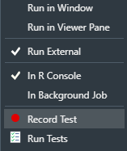

```{r setup, include=FALSE}
knitr::opts_chunk$set(echo = TRUE)
```

## Introduction

Academia has evolved a lot, there have been a lot of new enhancements in subjects and the level of studies. Research output has been on the rise as people regularly come up with innovations and new theories to understand the world we live in. Psychology is a scientific study that involves the human mind and behavior^1^. It involves the conscious and the unconscious phenomena that includes feelings and thoughts^1^. Whenever a new implementation is done in the realm of academics the psychological impact of the that change is always looked at for the best implementation. If it's found that the change has affected the student population negatively, the change is either restructured or recanted. Pressure on students has increased with an increase in difficulty and competition. Academia and Psychology go hand in hand and are dependent on one another in many ways.

A student that is undergoing academic stress will have psychological signs that point towards him/her having stress^6^. This an example that can be used as a testimonial to put academic performance and mental or social factors into context where one effects the other. We will use previous research conclusions to set the background of the dashboard created to show the effects of the social and economic factors on the performance of students.

The dashboard created can help understand the data in a graphic manner which will make it easier to understand the effects of different factors on one another using the chi-square tests. Regression between all the continuous variables is available to show the correlation strength and relation between one another.

## Background

We find provenance of this dashboard in many researches that concluded having a significant effect on student performance by various social and economic factors. There are a lot of variables that we can use to conclude the same using various hypothesis testing methods. We have used Correlation, Chi-Square Tests and Regression to understand the relationship between variables.

Distance Learning has become routine in the recent times when we all are forced to stay away from each other and shift to an online first study routine due to COVID-19. When this idea was just a new thought there was very little data to play with and understand a student's performance^2^. When the students are not in the same room as the professor, getting to know the students and their performance is very difficult. The only way that the professors have for having a better reach to the class is to understand if the topic has been understood by most of the students. Assignments help in understanding if the student understood the topic and the task assigned. Demographic being an important part of the equation alongside the marks that they score in the assignments and exams. The research^1^ works on a supervised learning algorithm that uses the data and predicts a set of students that will or can perform poorly. This will help the professor to get in touch with them proactively and make them understand by pushing them over the limit for that extra performance. Here as we see demographic information of the student is an important variable that helps the model predict the student performance. The success of this model making approach is supported by the accuracy of 62% initially which increases to a whooping 82% before the final examinations^2^. This goes to show that factors other than marks affect a student's performance and can be pushed to achieve greater marks by supporting them in things that are not directly related to academia.

The data used in the application has been used in this research^3^ to predict the best setup for the school to look into the life of the students to improve their marks. The research is based in Portugal where the school leaving percentage is nearly 2.5x the European Average of school leaving in the age group of 18-24^3^. The model in the research involved other factors other then intelligence and was used to predict better. A great amount of accuracy was reached when the record had one of the both other period marks other then the target period marks. This model takes into consideration that all the factors that are not directly related to a student's score also influence the performance to a considerable extent. The school management can look at the research that quantifies a variable's effect on the student performance and can improve in those areas to get to a better scoring student population that doesn't flunk out or leave school preemptively.

Age is an imminent fact of life, we are all growing towards being old and mature. The research upon careful inspection concluded that with increase in the age the ability to score and comprehend decreases in vigor. The research studies the *Relative Age Effect (RAE)*. This research has the socioeconomic status and the type of school in context to check the effects of all these combined on a population of eighth graders. The article^4^ works on structural equation modelling (SEM) to get the latent variables and work on the measured or indicator variables to get the relationships between each other. The method involves using a pool of students that are enrolled in the same year of school to keep the *RAE* at the minimum. The pool of students is further divided into 5 groups of G1,G2, G3, G4, and G5 where G1 is a group of people who are oldest and G5 are the youngest. Study conducted on *15,234* students supported that *RAE* is a real phenomenon which was seen when the eldest group didn't standout in performance and the G2 group scored the most marks which then dwindled down until the last group of G5. This shows the effect of *RAE* that proves that when a student is enrolled in the schools earlier are at a greater advantage to score more but also shows how being a little mature for the class can help with a better progressed neurologically development brain. This can help the student reach the optimal performance and reduce stress induced for scoring competitively.

Student's attendance in the class can play a very important role when it comes to performance directly related to the score in the application under the regression tab in the application. As we can clearly see that when the absences are put against any period marks the correlation comes out to be negative. We can conclude that as the absences increase the performance starts to dip. However the sample space is too small to conclude that generally but the correlation stands negative in the small space too. Researchers tried to get the non-academic reasons for their poor academic results. They found a significant relationship between the attendance of the student and the results^5^. Furthermore, apart from the absences they could also find Other significant findings which included the relationship between attendance and the level of study; work shift; ethnicity; whether participants had any dependents; and how studies were funded^4^. There is a constant willingness and want to push the country's education and research output for the better. Which cannot be done without keeping in mind the latent factors of the social standing and the economic status of the student. To improve the output an all around development with respect to each facet of life of a student will have to ameliorate so as to give the best result possible.

Gender can also play an important role in understanding the results of the student^6^. When put into context the socio-economic factors, this could support all the previous researches in this realm. The research also deals with a bias from the selector's point of view. Nonetheless, gender's effect was seen during the study where most of the girls were found to be overachievers and very less of them were found to be in the underachiever group^6^. The study also found the association of parents with the school to be a factor that added to be a significant factor in making an impact on a student's performance^6^. This shows how different factors affects the students in many different manners, even the age  along with the factors have different impact on each other and the scores as well.

Human beings are constantly growing up, everyone of us has been through adolescence. It's the time when we all go through major changes with respect to everything in our body. The hair, the growth spurt so on and so forth. This is a very confusing time for anyone who goes through it without a lot of information about it. This period of time often comes with a thought that makes the student feel out of control. This can develop stress and confusion with respect to all these aspects in life. During this time the students seek out support in people and try to fit in the crowd. This has been a reason that affects their marks significantly^7^. The effect has been negative for the ones that are trying to find their footing in the crowd^7^. To mitigate this decline, we need to uplift as many facets of their life as possible as we have seen in context of other researches that intelligence isn't the only factor that determines the score level of the student but there are many factors that affect a student's marks. To prevent the decline in middle school performance of students it is important that we try to develop their environments at school and at home which help them feel supported^7^. The research concluded that social and psychological factors help predict the GPA with a greater accuracy^7^. It also was able to gather a very unique insight into the data that showed that the importance of family involvement in a student's life was seen to be increasing in the female students rather than the male students in terms of their performance^7^.

## Instructions to Run

### Ways to run

There are 2 ways to run the project. It's code is hosted on an open-source repo on GitHub. It can be run locally or online where it is hosted.

> The GitHub repo for the code can be found [*here*](https://github.com/jishant07/TermProject-DAR) => <https://github.com/jishant07/TermProject-DAR>

1.  *How to Run Locally* : If we wish to run the project offline, we clone the open source project and then open the project folder in RStudio. After opening the source code in RStudio the steps that we need to follow in order for the project to run offline are :

-   Installing of packages : The project runs on various dependencies that we need to have in our local machine for this project to run successfully. The command to install any missing dependencies is. `install.packages("package_name")` .\
    The dependencies required for the project to run successfully are:

    1.  shiny (The framework that we use to run the application)
    2.  DT (This is used to display the data table)
    3.  corrplot (This is used to display the correlation matrix)
    4.  ggplot2 (This is used to plot the graphs)
    5.  shinydashboard (This is used to have a dashboard generated)

-   Selecting an Option to run the app using : Once we have opened the project into RStudio and installed all the above mentioned dependencies. It's time to run the project. We can run the project in 2 very simple steps.

    1.  Select where the project should run  
      
    From the menu above we can select it to run in a separate window, in the viewer pane to the right or an external browser.

    2.  Once selected, we can then press the Run App Button for the app to run\
        

2.  *How to Run it Online* : This is a very straight forward approach to run the project. The reason being that all the things that we had to do when this project was to run offline are already done. All that remains for us to do is to go to the link where the application is hosted. The link hosts a standalone version of the project which is publically accessible.

> The app is hosted at [*shinyapps.io*](https://jishant-acharya.shinyapps.io/term_project/) => <https://jishant-acharya.shinyapps.io/term_project>

## About the Application

### Information about the Framework

The project is made with a R Package known as "shiny". This is a package that helps us develop interactive web applications with R. It's very intuitive and helps us make pages with a lot of information crammed in them according to our requirements in a very beautiful manner. This also supports CSS themes that gives us all the more control over the design of the page.

### Data set Description

The first section is there to describe the data in a table format. The table is a data table that has a search input that can search the whole data set to filter as required. Further down there is a box that explains each variable present in the data set. That box has information about the type of the variable and what the records signify. We also have a data set summary on this page, this helps us understand the whole data set statistically.

### Correlation Plot

This is the plot done on numerical columns, this section has a correlation plot that helps us roughly understand the relation between each variable in a graphical manner. This reveals that G1, G2 and G3 have a correlation with mostly all of the variables which successfully helps us show that the socio-economic factors have a significant relation on the marks irrespective of their period. The relation can be positive or negative in nature according to the effect.

### Factor Distribution

This section helps us get the distribution between all the factors, this helps us plot graphs based on the selected factor. It helps us get various distributions of factors. This can help us get how balanced the sample is. It helps us to visualize the distribution with the help of a bar graph.

### Chi-Square Tests

This section is a very important this helps us get run chi-square tests on the factors of the data set.This helps us do hypothesis testing to see what all factors are correlated to each other. This is a very important tool that will help us understand the dependence of variables on one another. This helps us understand the inter-variable dependence of one on the other.Here we can know if there is a significant dependence of variables on each other.

### Regression

This section plots the graph with a regression line which shows us the correlation strength between the selected options. This helps us peg everything against each other and helps us understand the strength of correlation also. This page works to generate a regression equation as well which mathematically shows the relation with the slope and the intercept. This regression plot helps us get type of relation between the variables, may it be positive or negative. It also helps us with information about the strength when we see the strength of the regression line.

Here, we see that all the relations are linear in nature and have at least some dependence on the other variable may it be positive or negative or even weak or strong.

## References

1.  Wikipedia Contributors. Psychology _Internet_. Wikipedia. Wikimedia Foundation; 2018. Available from: <https://en.wikipedia.org/wiki/Psychology>
2.  KOTSIANTIS S, PIERRAKEAS C, PINTELAS P. PREDICTING STUDENTS' PERFORMANCE IN DISTANCE LEARNING USING MACHINE LEARNING TECHNIQUES. Applied Artificial Intelligence. 2004 May;18(5):411--26.
3.  Cortez P, Silva A. USING DATA MINING TO PREDICT SECONDARY SCHOOL STUDENT PERFORMANCE. EUROSIS. 2008;5(978-9077381-39-7).
4.  Navarro J-J, García-Rubio J, Olivares PR. The Relative Age Effect and Its Influence on Academic Performance. Dalal K, editor. PLOS ONE. 2015 Oct 30;10(10):e0141895.
5.  Tani K, Dalzell E, Ehambaranathan N, Murugasu S, Steele A. Evaluation of factors affecting students' performance in tertiary education. Journal of Pedagogical Research  _Internet_. 2019 May 23;3(2):1--10. Available from: <https://www.ijopr.com/download/evaluation-of-factors-affecting-students-performance-in-tertiary-education-6400.pdf?fbclid=IwAR20BgrOoBLQzJnfLJ1UCP05DZJ8tvtbJTjMFPbKc1MViV0HDdqkAi15g0U>
6.  Ford TR. Social Factors Affecting Academic Performance: Further Evidence. The School Review. 1957 Dec;65(4):415--22.
7.  Li Y, Allen J, Casillas A. Relating psychological and social factors to academic performance: A longitudinal investigation of high-poverty middle school students. Journal of Adolescence. 2017 Apr;56:179--89.
